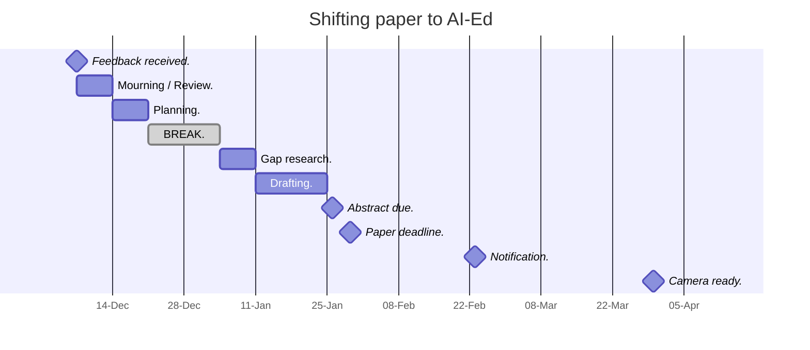
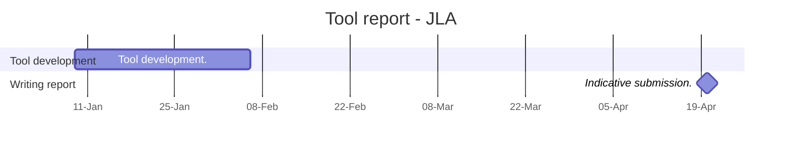

---
{"dg-publish":true,"permalink":"/working-notebook/"}
---


# Writing plan

## For [[lak-26\|lak-26]]

[[workshop--causal-modelling-lak-26\|workshop--causal-modelling-lak-26]] materials to prepare, finalise. This includes [[requirements-for-a-causal-modelling-support-tool\|requirements-for-a-causal-modelling-support-tool]] that will be partially built into a new version of [[loopy\|loopy]], which in turn could be a tool report for the [[journal-of-learning-analytics\|Journal of Learning Analytics]] (see below). 

LAK conference: **27 April - 1 May 2026** in Bergen. [[lak-26\|lak-26]]

## For [[aied-26\|aied-26]]

Festival of learning, Korea, is a mix of [[aied-26\|aied-26]], [[edm-26\|edm-26]] and [[l@s-26\|l@s-26]] (could go to any of these, but AIEd call seems appropriate). [AIEd-26 call for papers](https://www.aied-conference.org/2026/call-for-paper)



AIEd conference is in **Soul, Korea** from 29 June - 3 July 2026, as part of the [[festival-of-learning-2026\|festival-of-learning-2026]]


## [[journal-of-learning-analytics\|JLA]] tool report on revised [[loopy\|loopy]] version with data tracking




## [[journal-of-learning-analytics\|JLA]] paper on [[writing--navigating-the-causal-inference-landscape\|Navigating the causal inference landscape]]

This is the "paper 1" in the thesis, outlining the various [[causal-inference\|causal-inference]] methods and setting up the scene for the paper [[Sources/@hicksThinkingCausalModels2022\|@hicksThinkingCausalModels2022]]. 

```mermaid
gantt
	title Navigation paper - JLA
	dateFormat YYYY-MM-DD
```

# Task dump

- [ ] Thrive - any opportunities for the data collection in the next session with DoE? Can we connect to their big dataset? Reach out to Roman. 


# To Do

## This week

> [!important] **This week**
> ```tasks
> status.type is not DONE
> description includes #todo/this-week 
> ```

## In progress

> [!todo] Half-done
> ```tasks
> status.type is IN_PROGRESS
> description does not include #todo/this-week 
> ```


## Other tasks

> [!todo] Up next
> ```tasks
> description includes #todo/up-next
> ```

> [!todo]- Expand for all other tasks
> ```tasks
> description does not include #todo/this-week 
> description does not include #todo/up-next
> ```

> [!todo]- Expand for questionable tasks
> ```tasks
> status.name includes Question
> ```


> [!todo]- Expand for completed tasks - to delete
> ```tasks
> status.type is DONE
> ```


# Thesis plan 

Publication plan in [[- - home - -\|- - home - -]] 


## In compilation

### Section 1: The causal inference landscape

- [[writing--navigating-the-causal-inference-landscape\|writing--navigating-the-causal-inference-landscape]]

### Section 2: Thinking with models

- *Thinking with Causal Models: A Visual Formalism for Collaboratively Crafting Assumptions* [[Sources/@hicksThinkingCausalModels2022\|@hicksThinkingCausalModels2022]]

### Section 3: Collaborative Causal Modelling

- *Collaborative Causal Modelling* workshop, ALASI24 #getref 
- [[participatory-causal-modelling\|PCM]] paper(s), outlined here: [[Writing/writing--causal-model-elicitation-with-learning-domain-experts\|writing--causal-model-elicitation-with-learning-domain-experts]]

### Section 4: Other options...

- *Game Theoretic Models of Intangible Learning Data* [[Sources/@hicksGameTheoreticModels2025\|@hicksGameTheoreticModels2025]]

## In compilation, as related work.

- ASCILITE21: ==Opportunities to improve learning analytics for student support when using online assessment tools==, [url](https://publications.ascilite.org/index.php/APUB/article/view/353/328). Regression model without causal model, but highlights the confounding as a limitation and points to Lubke as a case of what might need to b e done. 
- JLA commentary: ==Learning outcomes and learning interventions==, I'm first on this subsection, but not on the whole peer commentary, which is how it is cited. [url](https://oro.open.ac.uk/92113/) [[Sources/@fergusonAligningGoalsLearning2023\|@fergusonAligningGoalsLearning2023]].
- ETRD: Causal reasoning with causal graphs ([[People/Joshua Weidlich\|Weidlich]]), [url](https://link.springer.com/article/10.1007/s11423-023-10241-0), [[Sources/@weidlichCausalReasoningCausal2023\|@weidlichCausalReasoningCausal2023]]
- BJET: Causal models to bridge the divide ([[People/Kirsty Kitto\|Kitto]]), [url](https://bera-journals.onlinelibrary.wiley.com/doi/full/10.1111/bjet.13321) [[Sources/@kittoUsingCausalModels2023\|@kittoUsingCausalModels2023]]

## Other papers, not related to work but in the field of Ed.


# Routines

- 2 x 25 min writing blocks. Could try 5 min editing as a transition activity?
- 1 x 25 min reading / learning block (can be DoE related)
- Leave reference hunting and sorting for the end of the day / downtime. Could even do editing then as well. 


# Other tasks

#todo/read - https://proceedings.mlr.press/v177/ahsan22a/ahsan22a.pdf something on cycles!!


#todo/read settable systems: an extension of pearls causal model with optimisation, equilibrium, and learning. Might be good for ... ??

- [ ] Build list of reading from KK paper recommendation on Bayesian model elicitation. Place in [[elicitation-of-causal-models\|elicitation-of-causal-models]]  
- [ ] Write up review from Bayesian elication
- [ ] Read https://arxiv.org/pdf/2107.08558.pdf and begin prep for HTI reading group


## Reading

- [ ] #todo/read Reeves, T. C., & Lin, L. (2020). The research we have is not the research we need. Educ. Technol. Res. Dev., 68, 1991-2001.
https://www.cecan.ac.uk/wp-content/uploads/2020/11/Final_Choosing-Appropriate-Evaluation-Methods-1.pdf - Choosing appropriate evaluation methods #read

https://arxiv.org/abs/1906.11247 - Beyond DAGs: Modeling Causal Feedback with Fuzzy Cognitive Maps #read

https://arxiv.org/pdf/2107.08558.pdf - A topological perspective of causal inference. No free lunch paper. For presentation with the [[human-technology-institute\|human-technology-institute]]? #read and summarise

https://dl-acm-org.ezproxy.lib.uts.edu.au/doi/pdf/10.1145/3565472.3592967 - example of using GCM to measure impact of an app intervention, framed as a way to extend RCT results (from Health) #read

https://bera-journals.onlinelibrary.wiley.com/doi/full/10.1002/berj.3960 - RCT's #read
