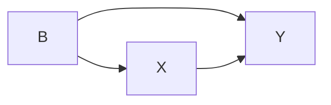

---
{"dg-publish":true,"permalink":"/dag-informed-dashboard-design/"}
---

#graphical-modelling 
A [[learning-analytics-dashboard\|LAD]] can be informed by a [[causal-dags\|Causal DAG]] through the [[adjustment-set\|adjustment sets]]. Anytime two variables are compared on a dashboard we can consider this as a regression between the two. If we want to compare them in an unbiased way then they should be considered in relation to relevant control variables. This could be implemented in various ways on a dashboard. Let us consider $X$ and $Y$ are shown, and their adjustment set includes.

#writing/blog 

ChattyG thinking about this - https://chatgpt.com/share/67bd0efb-e45c-800a-95ab-a49183991248 

## Paper ideas

[[People/Joshua Weidlich\|Joshua Weidlich]] keen to on this, grouped under [[writing--dag-informed-dashboard-case-study\|writing--dag-informed-dashboard-case-study]], although had second thoughts and was wondering how the applications might work in a non-dashboard feedback environment.

Some reading: https://learning-analytics.info/index.php/JLA/article/view/8399 

# Dashboard design perspective with DAGs

Typically the affordance of using causal Directed Acyclic Graphs (DAGs) is to inform statistical models to make causal claims from observational data [@pearlBookWhyNew2018]. Whilst this is probably the most important application of DAGs, the mechanism by which these claims are warranted can be generalised to other situations. The key to seeing this is recognising that the transition from a causal DAG to a causal statistical claim is through choosing the *least biased perspective* to look at the world through. I argue that this choice of the best perspective, despite being cloaked in the language of conditional probability, is well suited to informing dashboard design.

## To include B or not include B?

Let's start with as simple an example as possible to illustrate the point. Suppose we are interested in the effect of **X** on **Y**, and we have one other variable, **B** (clearly labelled for the bad pun). We will compare the decisions made by a statistical modeller and a dashboard designer in how to examine the relationship between **X** and **Y**, knowing that **B** is out there making things difficult.

### Statistical design choices

From a statistical point of view we have a decision to make - do we include **B** as a covariate in the model or not? 

$\begin{align}
Y &\sim X \tag{1}\\
Y &\sim X + B \tag{2}
\end{align}$

Often, the choice is made to include **B** in the model. We have the data, so let's include it - the more the better, right? LINK TO CAUSAL SALAD

### Dashboard design choices

From a dashboard design point of view this is slightly more complicated (there are some more options), but I'd argue amounts to a similar decision. Suppose we are displaying the relationship between X and Y in some plot, call it $\Pi_{Y,X}$ (I'm making up my own notation here[^1], which will hopefully help make comparisons later). This could be a scatter plot, or a pair of distributions side by side, whatever is natural for the kind of data X and Y represent. We would like to know should we:

- Show $\Pi_{Y,X}$ as a single plot, or a series of plots, each for different values of **B**? (i.e. small multiples)
- Include B as a filtering variable, or not? (i.e. an option to slice the data using **B**)
- Adjust the values of **X** and **Y** according to **B** before we display them?

Each of these choices boils down to either showing the plot as it is $\Pi_{Y,X}$, or showing it within levels of **B**, $\Pi_{Y,X|B}$. I'd posit that a dashboard designer would usually allow for each option on the same dashboard. We have the data, so let the user see all the options - the more the better, right?

## DAG informed design

The whole point of using our knowledge of the system, encoded in a DAG, is to help choose the best "perspective" to look at the data to minimise bias. It does this by suggesting an "adjustment set" of variables. 

Given a DAG, and a relationship to examine (in this case X -> Y), we can compute the variables to include in the adjustment set to have the least biased view of the relationship (and there are nice tools [link to dagitty] that can do this). 

This all depends on our causal understanding of the system.

Suppose we believe that the following DAG represents how the system works: 

In this case we should estimate the relationship between X and Y from the perspective of the values of B, which, written in the language of conditional probabilities, is:

$$P(Y|X)=\sum_{B}P(Y|X,B)$$

However, suppose instead we have the following DAG describing our knowledge of how X, B and Y are connected:

In this case we should compute $P(Y|X)$ directly - if we view this from the perspective of $B$ we mask any effects of X on Y that pass through B and mislead ourselves. 

### Statistical design choices

For a statistical model the translation is fairly straightforward. If we are to should compute **P(Y|X)** directly then we use the model **Y ~ X**. If we should be adjusting for **B** then we use the model **Y ~ X + B**.  Note that we do not use both - it is one *or* the other!

### Dashboard design choices

For a dashboard the design choices are a bit more complicated because it is a less constrained environment than a statistical model. However, I'd say the advice should be the same:

- If B should be adjusted for then use $\Pi_{Y,X|B}$ only. This could mean:
	- **Filtering** on B: Setting the dashboard so that a particular value, or range of values, for B must be selected to view $\Pi_{Y,X}$. Do not allow for the full range of values of $B$ to be available when viewing the plot.
	- **Small multiples** of B: Works well if B is a discrete variable with not too many options, by showing the relationship between X and Y only for a particular value of B. Again, you would not show the relationship between X and Y for all values of B together.
	- **Matching** on B: Design $\Pi_{Y,X|B}$ to compare differences between X and Y whilst matching on B. This can be done by using a visual cue (e.g. colour, shape, linkage) to draw comparisons between similar values of B, rather than the group as a whole. It is also used, perhaps less obviously, in a time series, such as plotting wages vs house prices. The confounding variable is inflation / time but by matching with time and looking at the difference between the two we get a better perspective. 
	- **Scale** / adjust by B:  If working with continuous variables it can be possible to adjust X and Y according to the value of B. For the previous example this might be looking at "real" wages vs house prices, which is scaling each of the variables by the confounding variable, inflation. 
- If B should **not** be adjusted for, then it should not be included in the dashboard as a way to filter, match, or scale the view of $\Pi_{Y,X}$, at least not without a big warning that this view is biased in light of how the causal structure of the system is understood. 

## A visual comparison

Below is a comparison of a simulated scenario where we know the correct estimate of the effect is 0.5, but that B also has an influence and should be controlled for. The upper plot represents the direct estimation of the effect, and directly plotting the relationship between X and Y. The lower plot shows the estimation when we include B as an adjustment, and also adjusts the Y values accordingly to better show the (unbiased) relationship. 

I believe thinking causally about systems is important if we want to make sensible claims from data. The medium through which these claims are built, be it statistical models or visualisation, should not exempt one from thinking carefully about how causal claims might be warranted.

[^1]: $\Pi$ being "Pi" for "Plot", since "P" has been used for "Probability" and Graph would have been just as confusing. 