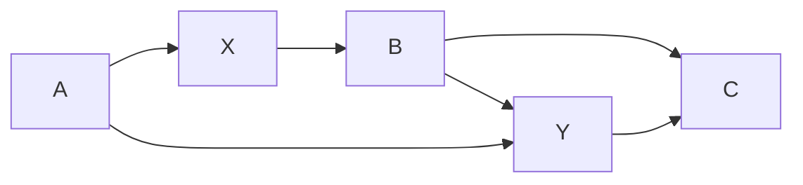
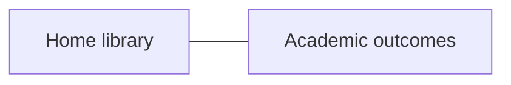
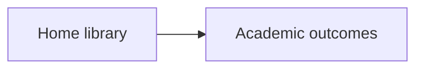
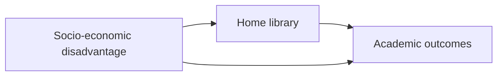
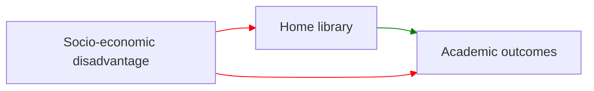
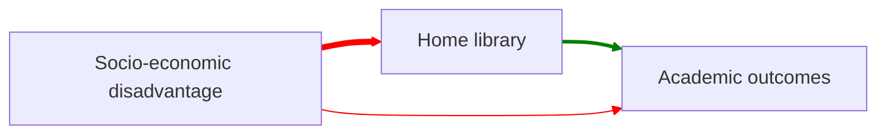

---
{"dg-publish":true,"permalink":"/participatory-causal-modelling/"}
---

#participatory-modelling

The process of collaboratively constructing a [[graphical-causal-model\|graphical-causal-model]], using the requirements of [[causal-dags\|causal-dags]] to guide the incremental formalisation of the model. Further detail of the causal relationships might be specified in the form of [[signed-edges\|signed-edges]],  [[fuzzy-edges\|fuzzy-edges]] , or  [[functional-edges\|functional-edges]]. This process ideally happens with a range of experts, but critically it aims to facilitate more meaningful collaboration between [[data-experts\|data-experts]] and [[context-experts\|context-experts]].  This is done using the [[visual-formalism\|visual-formalism]] of a graph representing the causal structure. 

## Protocol (Research)

> [!warning] General vs Research protocol
> The end game is that this will help form the framework for guidelines to running these kinds of participatory modelling sessions with educators. As such there will be parts of this protocol that are part of the *research* design that would not form part of a general protocol, which will be slowly developed in [[protocol-for-PCM\|protocol-for-PCM]].

### Research Aim
The aim of running these sessions is to see how valuable they are as process for thinking about a system, and as a way to built a useful product (the [[graphical-causal-model\|GCM]]). 

During the course of the sessions, designed as semi-structured interviews aimed at answering:

- [[RQ1. Can non-technical experts co-design useful causal models?\|RQ1. Can non-technical experts co-design useful causal models?]], including:
	- [[RQ1.1. What level of technical expertise do participants have?\|RQ1.1. What level of technical expertise do participants have?]];
	- and possibly [[RQ1.5. Can the model be used to plan future research?\|RQ1.5. Can the model be used to plan future research?]]
- [[RQ2. Does participating in causal modelling promote deeper thinking about a system?\|RQ2. Does participating in causal modelling promote deeper thinking about a system?]]
	- [[RQ2.1. What level of context expertise do participants have?\|RQ2.1. What level of context expertise do participants have?]]

#### 0. Organisation

##### 0.1 Session structure and set up

Sessions varied from 45 to 90 minutes long. They began with a short introduction to the process, followed by the collaborative design of the causal model, and a reflection at the end. Sessions were recorded to capture the participants discussion (audio) and the graphical model progression (video). Consent from participants was obtained across two aspects of the modelling sessions. Firstly, consent for the session audio and video to be recorded and analysis of the transcript. Secondly, consent to share the final [[graphical-causal-model\|GCM]] to some degree specified by the participant. For example, can the GCM be shared in full, or do the nodes need to be redacted in some way? 

Sessions were recorded using a Teams session to utilise the transcription feature. 

#### 1. Introduction

##### 1.1 Understanding the participants aims and level of context expertise

The first initial question for the participant in the semi-structured interview was *why are they interested in modelling this particular system?* This aimed to help the facilitator frame where to begin in constructing the causal model, and to re-direct and bound the discussion where required. Next participants were asked about their experience and expertise in the field related to the system they will be modelling today. Initial questions were:
- *How many years have you been working in this field, or related to this field?*
- How they rate themself from *novice / curious* to *expert* - placing themselves on a continuum. To help guide this they were prompted to think about how difficult it is to find someone in their organisation that knows more about the system of interest than them, as well as if they have published or researched in the area (for academics).

These questions should help ascertain [[RQ2.1. What level of context expertise do participants have?\|RQ2.1. What level of context expertise do participants have?]].
##### 1.2 Understanding the participants level technical expertise

Participants will be asked **how comfortable they are with statistical models?** To guide this they will place themselves somewhere on the following progression, guided by the facilitator: 
1. *not at all comfortable* (coefficient is a dirty word)
2. *a little bit comfortable* (ok using / interpreting a regression model)
3. *comfortable without being an expert* (could write up a results section)
4. *very comfortable / expert* (could explain logistic regression to a friend)

They will also be asked their familiarity with [[causal-dags\|causal-dags]] as well, measured from
1. *not at all familiar*
2. *aware of them*
3. *familiar without being an expert* - might know about mediators, colliders, etc. They might also be familiar with similar kinds of structures, such as [[causal-loop-diagrams\|CLD]]s
4. *very familar / expert* - can visually inspect to suggest possible adjustment sets

For the last part, a possible 'test' example could be given the following diagram:

If we wanted to understand the effect of $X$ on $Y$, which variables should we include in our adjustment set? (Answer - $A$ but not $B$ or $C$)

These questions will help pre-assess the participants to better understand how much detail is required for the tutorial in building a graphical causal model, as well as ascertaining [[RQ1.1. What level of technical expertise do participants have?\|RQ1.1. What level of technical expertise do participants have?]]
##### 1.3 Short tutorial in Graphical Causal Modelling

Participants will be taken through a short example of making a GCM. Initially, they need to understand:

* Nodes represent variables / things that are important to the system. They do not need to be measurable, but that does help later.
* (Directed) edges represent the flow of causation. This is not deterministic - it is more like a flow of influence.
* Possible augmentation of directed edges, to include more information about the kind of influence that one node has on another. This can be in the form of:
	1. Polarity, via a + or – next to the edge or a green or red colour. This indicates if the cause has a positive or negative impact on the effect.
	2. Strength of influence, via shading / line weight or number of lines. This indicates strong / weak relationships between variables.
	3. A function, or class of functions, indicating the kind of relationship (such as linear, etc). This is highly formalised and would only be used with participants comfortable with such claims.

Participants <mark style="background: #ABF7F7A6;">do not need to understand the technical requirements of a DAG</mark> (no loops, for instance), only the basic rules of the visual formalism. These can be introduced later if needed, during the formalisation stage.

###### Causal model tutorial example - home library and academic outcomes

To facilitate the tutorial, the following example will be used as a guide:

Imagine we believe there is a relationship between the size of a students home library (the number of books they have at home) and their academic outcomes. We would represent this as:

If we then think that 'home library' is what has an influence on 'academic outcomes' we would change the diagram to:

But suppose we think of a third variable that indicates socio-economic disadvantage that the student comes from, and we think that it influences both the home library and the academic outcomes:

We might even indicate the 'polarity' of the edges - do they positively or negatively influence along the causal path?

We might even have a notion that some edges are stronger than others, and can give them more a thicker line:

*Side note:* The weighted edges are [[fuzzy-edges\|fuzzy-edge]], and the polarity edges are [[signed-edges\|signed-edges]]. It is also possible to be more precise with [[functional-edges\|functional-edges]] (specifying the functional form of the relationship) but this is unlikely to be needed for the tutorial - anyone adept enough at describing the functional form between two nodes likely has the necessary knowledge to do so. [[causal-loops\|causal-loops]] are also allowed, however they are unlikely to be explicitly stated in the tutorial.

#### 2. Causal model co-design

##### 2.1 Exploration
First the [[dag-space\|space of possible DAGs]] will need to be explored in some way to define what is required. There are two underlying concepts here that need to be teased out in the session: the [[bounds-of-a-GCM\|bounds-of-a-GCM]] and the [[granularity-of-a-GCM\|granularity-of-a-GCM]]. The bounds define what is 'in' and what is 'out' of the model, so which nodes / variables to include. The granularity is how 'deep' the model goes, and helps decide if we should split a node or combine a collection of nodes into a single construct. A GCM can be as small as 2 nodes (course granules) and still be informative, but as more detail is added and it becomes finer grained (more nodes, splitting nodes into parts) the GCM also becomes unwieldy. A balance needs to be struck with the participant, but as a rule of thumb keeping the number of initial nodes under 10 – 12 is a good rule, and interesting discussions can happen with 3 or more.
###### Exploration prompts
-  *What is the outcome variable you are interested in?* This is a typical way to start the modelling process. Once this is decided, then it can be followed with “what else influences this?”
- *What is important to this system?* This is another way to start, by simply listing the key factors / variables that are important to the system in question.
##### 2.2 Formalisation
Once the beginnings of a [[graphical-causal-model\|GCM]] is available it can be interrogated to see if it matches the participants understanding of the system, and also pushed towards a more [[formal-model\|formal model]]. A more formal model includes more detail on the edges (such as [[directed-edges\|direction]], [[signed-edges\|polarity]], or [[fuzzy-edges\|weight]]), as well as adhering to other rules such as no-loops in the case of a [[causal-dags\|Causal DAG]]. 
###### Interrogating possible edges
Once key variables are placed on the GCM, then each possible connection between two nodes can be asked:
- *Is there a link between these two nodes?*
- *What direction does influence flow?*
- {Optional} *Does this have a positive or negative effect (polarity)?* 
###### Interrogating possible paths
As more detail comes into the GCM it is necessary to begin comparing the flow of influence through the various [[causal-paths\|causal paths]] in the GCM. The simplest form of this is understanding if a [[mediator\|mediator]] is required between two nodes in the GCM. 
- *Does A -> B directly, or should A -> M -> B?* This asks if we should insert a mediator into the graph. This adds complexity to the GCM but might be important.
- *Do we really need M in A -> M -> B, or is A -> B sufficient?* This aims to reduce complexity in the GCM, at the cost of ignoring *M*.
- *Does A -> B directly as well as A -> M -> B?* This aims to understand if M mediates all the flow of causation between A and B, or if there is a combination of [[direct-effects\|direct-effects]] and [[indirect-effects\|indirect-effects]]. 
###### Interrogating possible confounding
A connection between two variables, A and B, may be due to a third variable, C, that causes both. 
- *Could the connection between A and B be due to something else causing them both?* This would change a graph of $A - B$ to $A \leftarrow C \rightarrow B$. 
- *Does $A \leftarrow C \rightarrow B$ explain the connection between A and B fully, or does $A \rightarrow B$ (or $A \leftarrow B$) directly?* 
###### Stepping between the abstract and the concrete
Participants may need to move between thinking abstractly about the general causal properties of the system and about about instances, or examples, of what happens in the system. This is articulated in Borsboom et al.'s #getref  [[theory-construction-methodology\|theory-construction-methodology]] as participants move between data / examples, to descriptions of [[phenomena\|phenomena]], to further abstractions about [[theory\|theory]]. The kinds of moves depend on which setting we move between:

##### 2.3 Thinking prompts

During the session it might be necessary to ask participants to verbalise their thought process. These will be simple prompts for participants to think out loud, or describe their concerns, when they appear thoughtful and are silent for a while. Additionally, it might be possible to clarify:
- *Are they finding the visual formalism restrictive?* (i.e. the rules / form of the GCM)
- *Are they finding making their tacit knowledge explicit challenging?* (i.e. formalising their own understanding) 
- *Are they finding gaps in their own understanding* (i.e. the process is highlighting possible imprecision in their prior thinking)

#### 3. Reflection

After the model is complete participants will be asked questions relating to two key themes: the potential value of the product (the GCM itself), and the potential value of the process of creating the GCM. 

##### Reflecting on the product
Depending on the level of formality reached (i.e. DAG / CLD) there will be different affordances available from the perspective of the data expert. This will be outlined briefly by the facilitator if required, however it is more important to understand how well the GCM has represented their tacit knowledge of the system.

*How well do you feel the GCM represent your understanding of the system?*
Participants discuss where they feel it would lie on the following scale (they are free to choose somewhere between the categories as well). 
1. **Trivially**. The GCM only represents the most simplistic form of their knowledge. The GCM is not useful.
2. **Simplistically**. The GCM represents a very basic understanding of the system. It might be useful as a communication tool for stakeholders where the nuances of the system are less important, or with an analysis in very restricted settings.
3. **Adequately**. The GCM represents a reasonable abstract understanding of the system. It would be useful in communicating to a range of stakeholders, and useful for analysis in particular settings.
4. **Well**. The GCM is a good representation of the system. It would be useful for analysis in a variety of settings and a good tool for communicating to stakeholders the nuances of the system.

*Why?*
Participants will be asked to explain why they think this about the representation. Is it to do with the complexity of the system, for instance? The lack of knowledge about the system? Where there any particular points in the process you felt the graphical representation was missing some critical property of the system? What were they?

*What might you feel comfortable using the GCM for?*
This helps frame the discussion around the earlier question on how well the GCM represents the system.

##### Reflecting on the process
Participants are asked to reflect on the process of thinking about their system using a graphical representation of the causal structure. 

*Did any new or unexpected viewpoints come to you as part of this process?*

*Has this process left you with any questions about your system that feel new to you?*

#### 4. Post session
Session recorded in teams to get live transcription as a starting point for transcribing the session. Session will be then transcribed, and de-identified. Name matching to pseudonyms will be stored on OneDrive with an additional password. Once complete, the transcription will be shared with participants to see if there is anything they want to redact from the interview. 
## Ethics

Form must ask for consent to publish exerts from transcript, and outline what parts of the causal model can be published.

Asking for extended consent

## Cases

