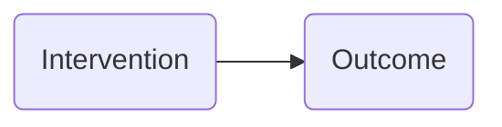
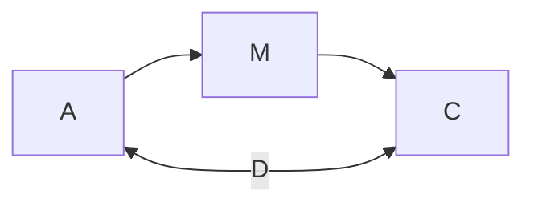
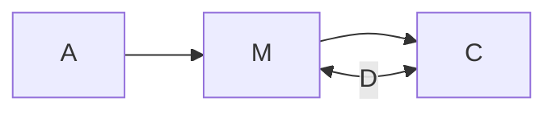

---
{"dg-publish":true,"permalink":"/protocol-for-pcm/"}
---

#participatory-modelling

- [ ] #todo - make sure this is in line with the ethics proposal, and this note doesn't appear elsewhere under a different guise

# Context

## Participants
- Expertise
- Diversity
- Power balance / dynamics. Particularly important when running group sessions.
## Aims
Exploratory? Targeted?
## Setting
This includes infrastructure and important aspects like materials - which should relate to meaningfully to both the aims and the participants. Also time. 

# Guiding principals

## Granularity
The model must balance two competing desires: accuracy in describing the system, and explainability of the model. This manifests in how many nodes are present in the graph. More nodes means more detail, finer granularity, "deeper" or closer to the atomic structure of the system. Fewer nodes will generally mean better explainability and computability. 

The process may move up and down between coarser and finer grains, and possibility in different sections of the graph. Some places need more detail, some less. 

# Session Structure
#todo - perhaps the prompts also need indicators of when to use them?
## Openings
The aim of the opening is to go from a blank canvas to an initial graph that has, at a minimum, some arrows going into an outcome of interest.

### Opening 1: Intervention and outcome
**Use when there is already a known outcome and intervention.** 
If the model is already built around understanding the (potential) impact of an intervention, then the initial graph could be proposed:

> [!question] Prompts for intervention and outcome opening
> - *What else causes the outcome?* This will add extra nodes with arrows into the Outcome.
> - *What other things of interest might be influenced by the intervention?* This will create nodes with arrows from the Intervention. These may not be relevant in the long run - but this depends on the final structure of the model. If unsure, it may be worth a placeholder node called "Other effects".   

**Finish when participants are comfortable that they have most of the key 'other causes' covered.** This may also be guided by how many nodes get introduced, and the [[protocol-for-PCM#Granularity\|Granularity]] principals. In the end they should have a graph with multiple arrows into the outcome. 

### Opening 2: Expanding sphere of influence

**Use when participants have an idea of the outcome, but not yet of what particular intervention they are interested in.** They might be wanting to exploring what intervention might be best. Also **use when the outcome might need more clarification / unpacking**. 

Participants start with the outcome at the centre of the graph. They then place nodes around the outcome that directly cause the outcome. 

> [!question] Prompts for expanding sphere opening
> - *Is the outcome actually made of different kinds of things? What are they?* This then helps break a slippery to define outcome into components, which act as the immediate direct causes into the more generic outcome. Participants might then find it easier to think of causes leading to these more specific components, than into the general outcome. They might also scrapped the generalised construct itself, and view the outcome as a collection of similar things in the centre (that possibly heavily influence each other) that you might group together as a similar construct. 
> - *Can you group any of these nodes together?* This helps participants group kinds of nodes together. Later on this might help change the granularity of the graph if needed, by redefining a cluster of nodes under a new label. 
> - *Which of these influences **directly** influence the outcome?* This gets participants to begin drawing arrows into the outcome.

**Finish when participants feel they have the direct influences of the central outcome node covered.** 

### Opening 3: Listing factors
**Use when participants need a gentle introduction to thinking about causal structure**. It may also be useful to **use when the list of influences on the outcome needs to be kept lower.**

Participants start with an Outcome of interest, and then make a list of factors that influence the outcome. This could be in the form of a list on paper, or might also be placed along a scale from strong to weak influence, or perhaps on a 2-dimensional scale that also includes strong to weak evidence / confidence about the influence. 

> [!question] Prompts for listing factors opening
> - *Which factors are most important?* 
> - *Are some of these factors describing the same thing? Or parts of the same process?* In this case, it might be possible to reduce the number of factors by grouping some of them together under a new label and then re-evaluating the order of importance of the factors.

**Finish when the list of most important factors is generated and participants can draw a minimal causal model with the Outcome at the end / centre and the factors with arrows into the outcome.** 

### Opening 4: Building an intervention path
#todo outline starting with A -> B, and then build the steps between A and B.

## Formalisation

Once the beginnings of a [[graphical-causal-model\|GCM]] is available it can be interrogated to see if it matches the participants understanding of the system, and also pushed towards a more formal model. A more formal model includes more detail on the edges (such as direction, polarity, or weight), as well as adhering to other rules such as no-loops in the case of a Causal DAG.

### Interrogating nodes
There are a few main operations on the nodes of the graph that can be considered:
- Addition of a node. This can be done at the edges of a graph (introducing a prior cause, or a post effect) or inserted into a path (introducing a mediator). 
- Deletion of a node 
- Merging of nodes (creating a coarser grained model) 
- Splitting a node (creating a finer grained model)
- Shifting a node from describing a variable on a particular GCM, to describing which of a range of GCMs should be used. This might occur when the node seems to influence the existence of particular edges or paths, rather than other variables.

> [!question] Prompts for interrogating nodes
> - *Is there something else important that causes this? How can you change this node?* This adds a node as a cause somewhere on the graph. This might be required when beginning to think about how to intervene on a system.
> - *Is there something important, that you cannot measure?* Get's people to think about latent variables to add #todo word this better
> - *Is there something important that you cannot influence?*
> - *Is this node really needed now?* This can be asked of a node that appears at the edge of the graph. Perhaps it is at the end of a path, on it's own, and does not influence anything else and is not important for selection bias, for instance (this kind of reasoning would be nicely supported by a [[computational tool to support GCM reasoning\|computational tool to support GCM reasoning]]).
> - *Can these nodes be grouped together?* If a collection of nodes reside in a similar part of the GCM they might be grouped together to help simplify the structure of the graph and make it more explainable. For instance, they might all be common causes of the intervention and outcome, and can be thought of as a group of confounds that will get treated the same in the graphical analysis anyway. 
> - *Does this node influence other variables, or does it describe different graphs?* This is outlined below in [[protocol-for-PCM#Interrogating overall graph\|interrogating the overall graph]] and is a big decision to make. Sometimes it might be easiest to create multiple GCMs that describe different contexts, each context being different values of what this 'node' used to be. 

#todo - need to think about the relationship between latent variables and things we can measure. Where does this fit into the prompts?

### Interrogating edges
Once key variables are placed on the GCM, then possible connections between nodes can be examined. Note that it is not possible to do this exhaustively (too many options). It is important to remember that each non connected part of the graph is the (strong) assumption of independence.  

> [!question] Prompts for interrogating possible edges
> - *Is there a link between these two nodes?*
> - *What direction does influence flow?*
> - 

### Interrogating paths

As more detail comes into the GCM it is necessary to begin comparing the flow of influence through the various causal paths in the GCM. The simplest form of this is understanding if a mediator is required between two nodes in the GCM.

#### Does A ® B directly, or should A ® M ® B?

This asks if we should insert a mediator into the graph. This adds complexity to the GCM but might be important.

#### Do we really need M in A ® M ® B, or is A ® B sufficient?

This aims to reduce complexity in the GCM, at the cost of ignoring _M_.

#### Does A ® B directly as well as A ® M ® B?

This aims to understand if M mediates all the flow of causation between A and B, or if there is a combination of direct effects and indirect effects.

### Interrogating possible confounding? Part of paths?

A connection between two variables, A and B, may be due to a third variable, C, that causes both.

#### Could the connection between A and B be due to something else causing them both?

This would change a graph of A -- B to A ¬ C ® B.

#### Does A ¬ C ® B explain the connection between A and B fully, or does A ® B (or A ¬ B) directly?

Confounding may not fully explain the association between variables. This can be further interrogated by asking about possible strength (weights) of the different causal paths.

It might be worth adding a mediator, when:
Does:

Or does

### Interrogating overall graph

Link to node maybe influencing paths, instead of nodes. This might imply the use of multiple graphs for different context. Can be applied using mixture bayesian network stuff that HTI is working on. 

### What do we need for this process that we don't have?
#todo 
E.g. what else like the need for nodes influencing edges / graph types? Where does the formalisation practice break down?
How am I going to identify this in the sessions?

## Evaluation and comparison
This could be 'testing' in the form of the model against the data, or observed phenomena. It could also be comparison with other models (if this is run as a group session, or part of a sequence of work. )

This 'testing' could also be in the form of 'thinking of an example' (link to the [[theory-construction-methodology\|theory-construction-methodology]] bit about moving from phenomena to data?)
